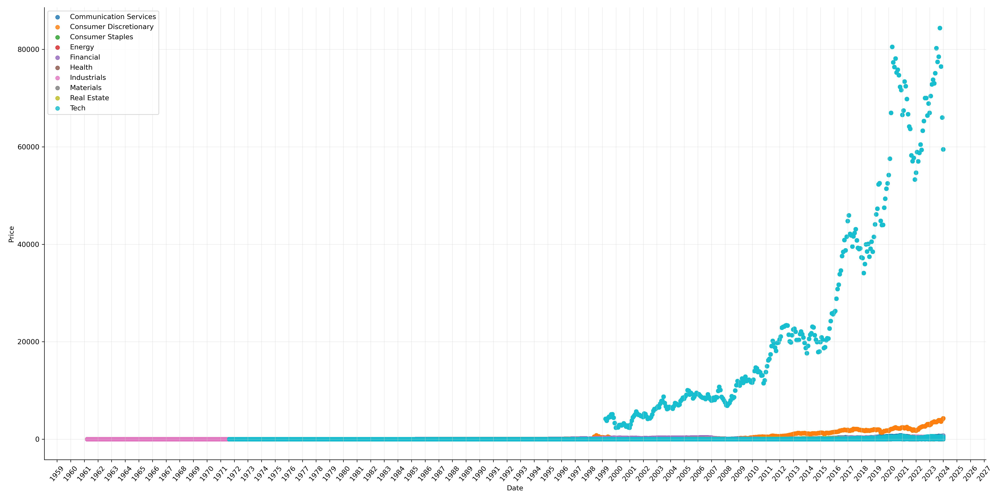
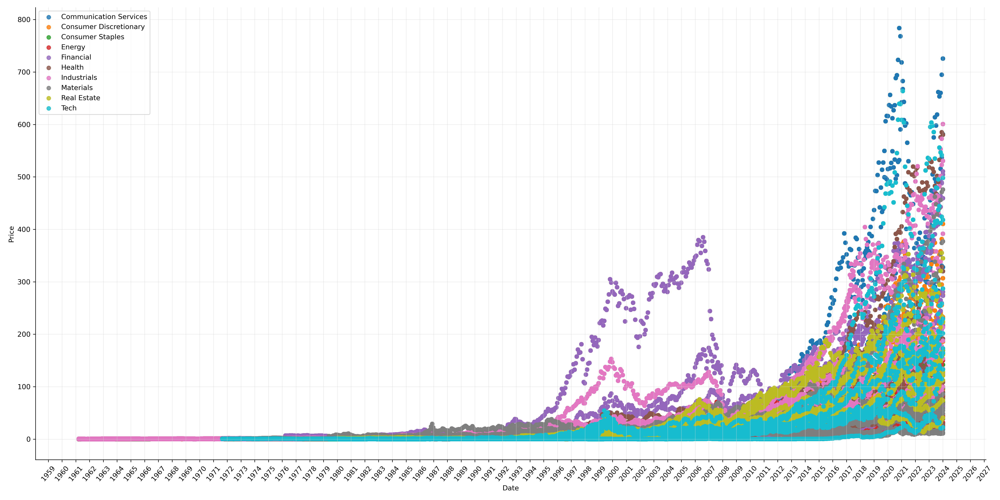
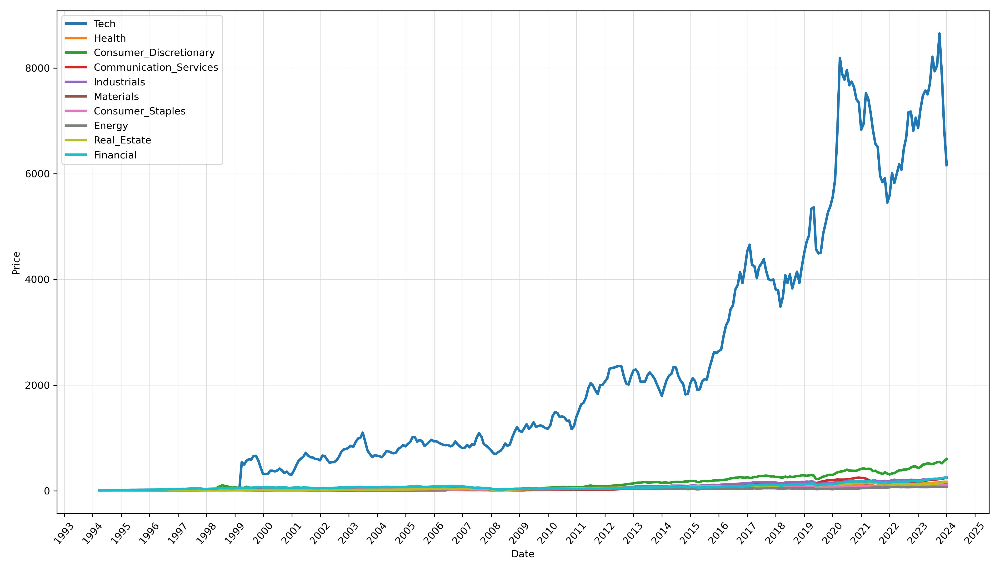
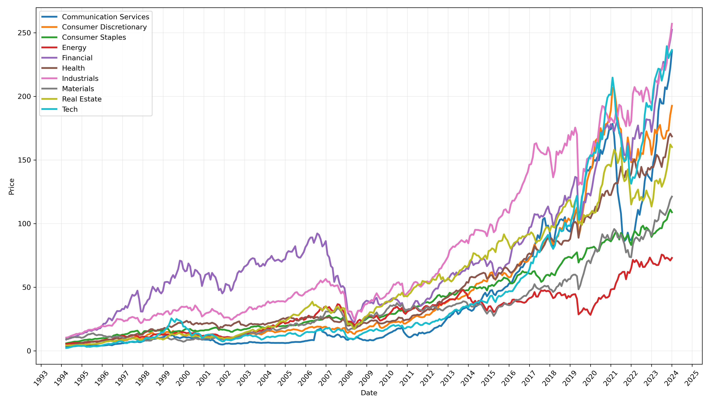

# Company And Industry Stock Performance.
Author: Giovanni Squillace 
Date: Oct. 28, 2024 
Read time: Approximately 8-10 minutes 

# Abstract

This paper explores the stock performance of the top 100 companies across various industries as represented by the iShares MSCI ACWI ETF, aiming to identify key factors influencing these trends. By analyzing sectors such as Industrials, Financials, Technology, and Communication Services, the research highlights how company performance correlates with broader industry dynamics and market conditions. The study employs a quantitative approach, utilizing historical financial data sourced from Yahoo Finance and analyzed using statistical methods. Findings indicate that industries with high global reach, innovation-driven practices, and significant growth potential tend to outperform others.

Additionally, the analysis underscores the impact of outliers, such as Samsung Electronics and Booking Holdings, which can skew overall industry performance. By excluding these companies, a clearer understanding of sector health emerges. The significance of this study lies in its practical implications for investors and policymakers, providing insights into investment strategies and market trends. Ultimately, the research advocates for informed investment decisions aligned with personal values while emphasizing the need for caution in navigating the complexities of the stock market.

# Keywords

- Fundamental Stock Market Analysis
- Industry Financial Performance
- Investment Strategies
- Sector Performance
- Return on Investment

# Introduction

### Disclaimer
This paper is for informational purposes only and does not constitute financial advice. The content presented is based on research and analysis, but individual investment decisions should be made with caution and in consultation with a qualified financial advisor. The authors do not assume any liability for losses or damages arising from reliance on the information provided. Always conduct your own research and consider your financial situation before making investment decisions.

### Background information
Investing in the stock market can be both exciting and daunting, as individual stock performance is influenced by various factors like company management, financial health, and broader economic conditions. For everyday investors, understanding these dynamics is crucial to making informed decisions. Each stock represents not just numbers, but the story of a company navigating its industry. By exploring how companies perform within their sectors, investors can gain valuable insights that enhance their ability to choose promising investments and grasp the bigger economic picture.

### Purpose of the research
The primary purpose of this research is to analyze the stock performance of various companies within specific industries and identify the key factors that influence these trends. This study aims to provide a comprehensive understanding of how individual company performance correlates with industry dynamics and overall market conditions.

### Significance of the study
This study is significant for several reasons. First, it contributes to the existing body of knowledge on stock market dynamics and provides a nuanced understanding of how industry characteristics affect company performance. Second, it could offer practical insights for investors and financial analysts, enabling them to make more informed decisions based on empirical evidence. Finally, by identifying key drivers of stock performance, this research can assist policymakers and industry leaders in understanding market trends and developing strategies to enhance economic resilience.

# Methods
This project examines the top ten highest-performing companies, ranked by percentage, from the iShares MSCI ACWI ETF across ten sectors. It analyzes how their stock prices and the overall performance of their respective industries have evolved over time. The sectors under review include Information Technology, Health Care, Financials, Consumer Discretionary, Consumer Staples, Energy, Materials, Industrials Real Estate, and Communication Services.

The choice of this ETF is intentional, as it provides a broader array of industries and companies compared to the S&P 500, which typically allocates a large portion of its weight to technology, approximately 25-30%.

*See the very bottom of the page for a full list of the companies used*

### Research design

#### Introduction
This research employs a quantitative approach to analyzing stock performance of the top 100 highest-performing companies from the iShares MSCI ACWI ETF. Data will be collected on stock prices, percentage returns, and industry performance over specific time frames.

To ensuring a comprehensive view of the selected companies and sectors, this study will utilize data sourced from financial databases and market reports provided by *yahoo finance*. Statistical methods will be applied to identify trends and facilitate an understanding of how individual company performance relates to overall industry dynamics. The findings will be presented through visualizations, such as charts and graphs, to effectively communicate the data insights.

#### Tools used
Python, JupyterLab, Pandas, MatPlotLib, Seaborn, and yfinance.

#### How the data was gathered
I began by researching the top-performing companies within each industry. After compiling a list of 100 companies, I proceeded to gather their historical financial data. Fortunately, Yahoo Finance provides a convenient python package called *yfinance*, which allowed me to easily interact with their API and download the necessary historical data into CSV files.

I successfully downloaded the historical data for all 100 companies. Conveniently, acquiring 10 to 40+ years of financial data for 100 companies does not consume significant storage space; the largest file, belonging to Walt Disney Co, was only 1.9 MB, while the smallest, belonging to AbbVie Inc., was a mere 355 KB. Although the total dataset amounted to 113 MB, it comprised an exhaustive 700 columns and over 968,000 rows, indicating there is still potential for further optimization.

#### Data cleaning and storage optimization
Upon reviewing the dataset, I realized that much of the information was unnecessary for my analysis. Consequently, I eliminated the extraneous data, resulting in a reduced file size of 17 MB, which represents an impressive space savings of *84.96%*.

However, my optimization efforts did not stop there. The dataset initially contained daily data spanning the last 10 to 40 years. To streamline the information further, I averaged the stock prices for each month. As a result, the total file size decreased to a mere 675.8 KB, achieving an overall space savings of *99.4%*. For context, the *smallest* file prior to optimization was 355 KB, while the *largest* file now stands at just 11 KB.

After averaging the stock prices by month, I proceeded to consolidate the data by industry. This step was straightforward; I combined all the companies related to technology into a single dataframe and exported it as a CSV, I then repeated the process for the other nine sectors. These individual industry dataframes will be utilized to create industry-specific graphs.

Additionally, I created a comprehensive dataframe that aggregates the data for all companies into one file. This consolidated dataset will be used for comparative analysis across all companies.

# Results

#### All company data
This graph illustrates the price performance of all 100 companies, with the data color-coded and labeled by it's industry. As evident, the graph features a significant spike, which will be important for subsequent analysis.

#### All company data with Samsung Electronics and Booking Holdings hidden
It became evident that there was a discrepancy in the data. Upon careful review, I identified that this was primarily due to two major companies that significantly outperformed their peers. To gain a clearer perspective on the performance of the other companies, I temporarily excluded these two from the dataset. The companies in question were Samsung Electronics Co. Ltd. and Booking Holdings Inc.

#### Industry performance
After plotting the data for each individual company, it became clear that the information was still somewhat difficult to interpret. To enhance clarity, I further aggregated the data by industry, allowing for a more straightforward comparison of which industries perform best. Additionally, I excluded all data prior to 1995, as there was limited relevant activity before that year.

#### Industry performance with Samsung Electronics and Booking Holdings hidden
As you can see from the graph above the influence both Samsung and Booking Holdings is still massively disproportionate. So i again temporarily excluded these two from the dataset.

#### Best performing industries
Consulting the graph that excludes abnormalities such as Samsung Electronics and Booking Holdings, we can observe the best-performing industries, listed in order: Industrials, Financials, Technology, Communication Services, Consumer Discretionary, Health Care, Real Estate, Materials, Consumer Staples, and finally, Energy.

# Interpretation and Implications

*As stated in the disclaimer this paper is for informational purposes only and does not constitute as financial advice. Individual investment decisions should be made with caution and with a qualified financial advisor.*

#### Key characteristics of a successful industry
From the graphs, we can infer that industries are more likely to succeed when they exhibit several key characteristics:
1. **High Global Reach**: Companies such as Boeing, Microsoft, and Meta exemplify the importance of a global presence.
1. **Innovation-Driven**: Industries that prioritize innovation, such as Apple, Pfizer, and Lockheed Martin, tend to perform well.
1. **Interconnectedness**: Technology innovations often enhance productivity in industrial sectors, while Communication Services facilitate financial transactions and business operations.
1. **High Growth Potential**: Companies like JPMorgan Chase, Berkshire Hathaway, Amazon, and McDonald's highlight the significance of growth opportunities within their respective sectors.

#### Investment strategies
When considering investments in a company or an industry-specific ETF, there are several key factors to take into account:
- **Demand for Products**: Assessing the demand for a company's products or services is crucial. For instance, companies like Lockheed Martin, which provides defense and protection solutions, or Microsoft, known for its widely used operating system, benefit from high and consistent demand.
- **Growth Potential**: Evaluate the potential for growth within the industry. Is the company positioned for expansion? Social media platforms like Facebook offer unique opportunities for user engagement and advertising revenue, while e-commerce giants like Amazon revolutionize shopping by delivering products quickly and efficiently.
- **Impact on Lives**: Consider whether the company’s offerings enhance the quality of life for consumers. Pharmaceutical companies like Pfizer, which develop life-saving medications, demonstrate a strong commitment to improving public health. Similarly, financial institutions such as Bank of America play a vital role in safeguarding assets and facilitating financial stability for individuals and businesses.
- **Market Trends**: Staying informed about broader market trends is essential. Emerging technologies, shifts in consumer behavior, and economic indicators can significantly influence industry performance. For example, the rise of renewable energy sources may present opportunities in the clean energy sector.
- **Competitive Landscape**: Understanding the competitive environment is critical. Analyze how the company stacks up against its competitors in terms of market share, innovation, and customer loyalty. Companies with a strong competitive edge are more likely to sustain long-term success.
- **Regulatory Environment**: Consider the regulatory landscape affecting the industry. Companies operating in heavily regulated sectors, such as healthcare or finance, may face challenges that could impact their profitability and growth prospects.

#### Investing in what you believe in
*This section presents subjective perspectives and should be interpreted with caution.*

Investing in companies and industries that align with your values, such as nuclear energy or disease prevention, is important for several reasons. First, it allows you to support advancements that resonate with your beliefs, contributing to the development of sustainable energy solutions or life-saving medical innovations. By directing capital towards these sectors, individuals can help drive positive change while potentially reaping financial rewards.

However, it is essential to approach these investments with caution. While the potential for growth in sectors like renewable energy and healthcare is significant, these industries can also face volatility due to regulatory changes, technological advancements, and market competition. Conducting thorough research and understanding the risks involved ensures that investments are made thoughtfully, balancing personal values with prudent financial decision-making. This careful approach not only safeguards individual portfolios but also promotes responsible investing practices that can lead to long-term benefits for both investors and society.

# List of Companies and Industries Used in the Research

### 1. **Information Technology**
1. Apple Inc.
2. Microsoft Corporation
3. NVIDIA Corporation
4. Alphabet Inc. (Google)
5. Intel Corporation
6. Samsung Electronics
7. Adobe Inc.
8. Salesforce, Inc.
9. Oracle Corporation
10. Texas Instruments Incorporated

### 2. **Health Care**
1. Johnson & Johnson
2. UnitedHealth Group Incorporated
3. Pfizer Inc.
4. Roche Holding AG
5. Merck & Co., Inc.
6. AbbVie Inc.
7. Amgen Inc.
8. Medtronic plc
9. AstraZeneca plc
10. Gilead Sciences, Inc.

### 3. **Financials**
1. JPMorgan Chase & Co.
2. Bank of America Corporation
3. Wells Fargo & Company
4. Berkshire Hathaway Inc.
5. Goldman Sachs Group, Inc.
6. Citigroup Inc.
7. Morgan Stanley
8. American Express Company
9. Visa Inc.
10. Mastercard Incorporated

### 4. **Consumer Discretionary**
1. Amazon.com, Inc.
2. Tesla, Inc.
3. Home Depot, Inc.
4. Nike, Inc.
5. McDonald's Corporation
6. Lowe's Companies, Inc.
7. Booking Holdings Inc.
8. Starbucks Corporation
9. General Motors Company
10. Walt Disney Company

### 5. **Consumer Staples**
1. Procter & Gamble Co.
2. Coca-Cola Company
3. PepsiCo, Inc.
4. Unilever PLC
5. Walmart Inc.
6. Nestlé S.A.
7. Colgate-Palmolive Company
8. Mondelez International, Inc.
9. Philip Morris International Inc.
10. Kimberly-Clark Corporation

### 6. **Energy**
1. Exxon Mobil Corporation
2. Chevron Corporation
3. TotalEnergies SE
4. Shell plc
5. BP p.l.c.
6. ConocoPhillips
7. NextEra Energy, Inc.
8. Eni S.p.A.
9. Schlumberger Limited
10. Equinor ASA

### 7. **Materials**
1. BHP Group
2. Rio Tinto Group
3. DuPont de Nemours, Inc.
4. Linde plc
5. BASF SE
6. Freeport-McMoRan Inc.
7. Newmont Corporation
8. Barrick Gold Corporation
9. Sherwin-Williams Company
10. Vale S.A.

### 8. **Industrials**
1. Boeing Company
2. Honeywell International Inc.
3. Caterpillar Inc.
4. Lockheed Martin Corporation
5. 3M Company
6. General Electric Company
7. Northrop Grumman Corporation
8. Raytheon Technologies Corporation
9. Siemens AG
10. United Parcel Service, Inc. (UPS)

### 9. **Real Estate**
1. Prologis, Inc.
2. American Tower Corporation
3. Crown Castle International Corp.
4. Simon Property Group, Inc.
5. Equity Residential
6. Public Storage
7. AvalonBay Communities, Inc.
8. Welltower Inc.
9. Digital Realty Trust, Inc.
10. Vornado Realty Trust

### 10. **Communication Services**
1. Meta Platforms, Inc. (Facebook)
2. Netflix, Inc.
3. Walt Disney Company
4. Comcast Corporation
5. Verizon Communications Inc.
6. AT&T Inc.
7. T-Mobile US, Inc.
8. Charter Communications, Inc.
9. Booking Holdings Inc.
10. Sony Group Corporation
